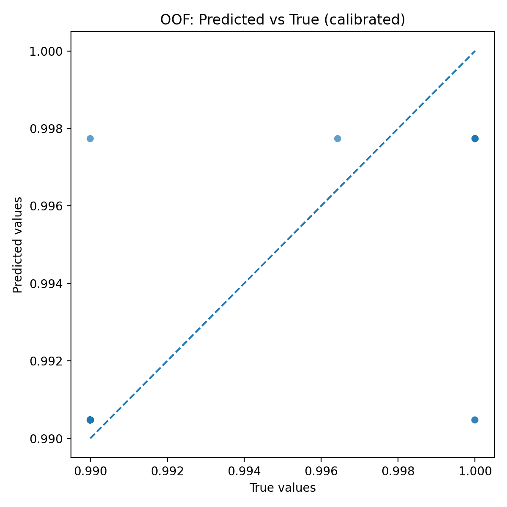
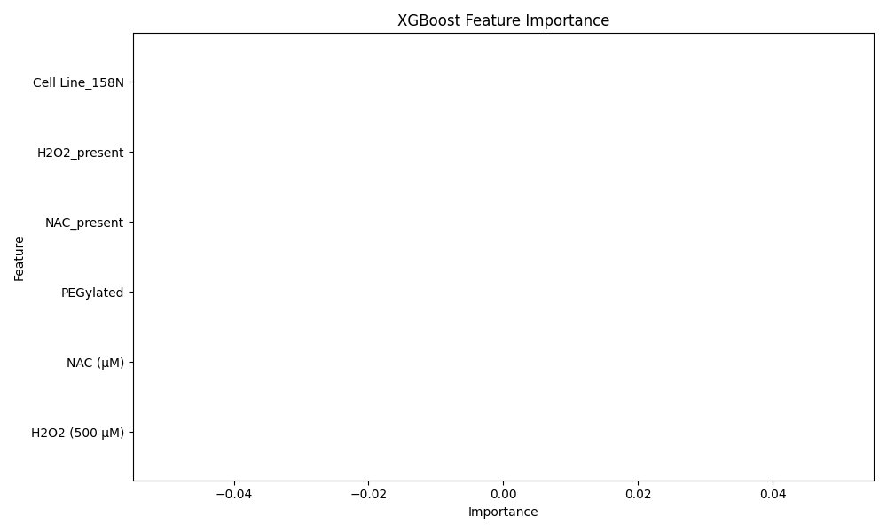

# AML-NAC-ROS Model

This repository contains code and datasets for analyzing **in-vitro responses of acute myeloid leukemia (AML) cell lines** to **N-acetylcysteine (NAC) delivered via PEGylated nanocarriers**.  

Using **feature-engineered machine learning pipelines** with:
- Cross-validation (GroupShuffleSplit, GroupKFold),
- XGBoost, Ridge, and Random Forest regressors,
- Isotonic calibration,  
- Residual and feature importance analysis,

the project evaluates ROS (reactive oxygen species) reduction in AML cell lines including **HL-60, NB4, and OCI-AML3**.  

---

## Key Results
- **Mean Absolute Error (MAE):** ~0.0012 (calibrated OOF predictions)  
- **Root Mean Squared Error (RMSE):** ~0.0024  
- **Spearman Correlation:** ~0.75 (calibrated model)  
- Strong alignment between predicted and observed ROS+ percentages across cell lines.  

---

## Repository Structure
- `scripts/` – Training, preprocessing, and evaluation scripts.  
- `data/` – Processed CSV datasets of AML cell lines and treatments.  
- `models/` – Saved joblib models and preprocessors.  
- `outputs/` – Plots (`.png`) and evaluation metrics (`.json`, `.csv`).  

---

## Example Plots
### Predicted vs True (Calibrated)


### Feature Importance


---

## How to Run
```bash
# Clone repo
git clone https://github.com/smathi89/aml-nac-ros-model.git
cd aml-nac-ros-model

# Create environment
python -m venv venv
venv\Scripts\activate   # (Windows)

# Install dependencies
pip install -r requirements.txt

# Train model
python scripts/train_ros_model.py

# Plot results
python scripts/plot_oof_results.py

